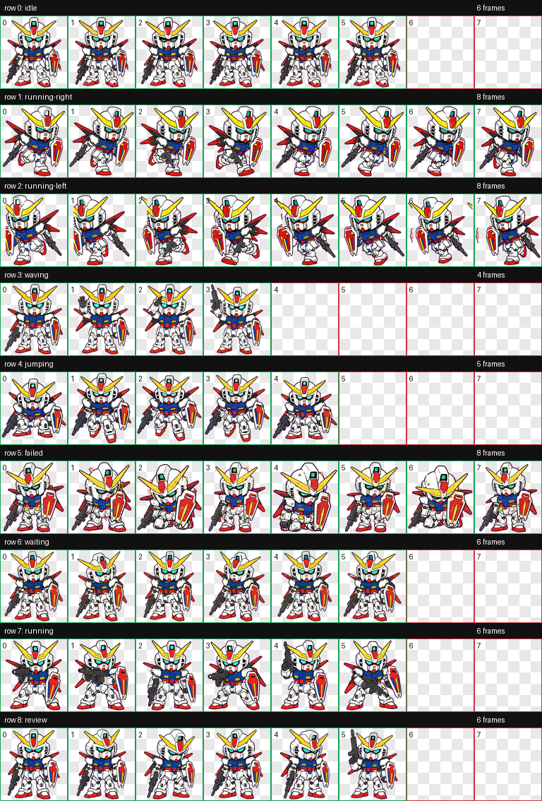

# 强袭高达宠物

Q版强袭高达 Codex 桌面宠物，以 2D 卡通风格的战斗伙伴形象呈现。

## 预览



## 动画状态

GitHub 首页的动画预览需要同时上传 `previews` 文件夹。上传完整文件后，下方 GIF 会自动显示。

### 闲置


### 跑步


### 挥手


### 跳跃


### 等待


### 失败


## 文件内容

此仓库包含 Codex pet 软件包文件：

- `pet.json` - Codex 桌宠配置文件
- `spritesheet.webp` - 透明背景精灵图
- `contact-sheet.png` - 总览预览图
- `previews/*.gif` - 各状态动画预览
- `validation.json` 和 `review.json` - 校验报告
- `install-to-codex.ps1` - Windows 本地安装脚本

## Install

在 Windows 上运行：

```powershell
powershell -ExecutionPolicy Bypass -File .\install-to-codex.ps1
```

桌宠会被复制到：

```text
C:\Users\lxn\.codex\pets\strike-gundam
```

安装后重启 Codex 或刷新桌宠列表。
